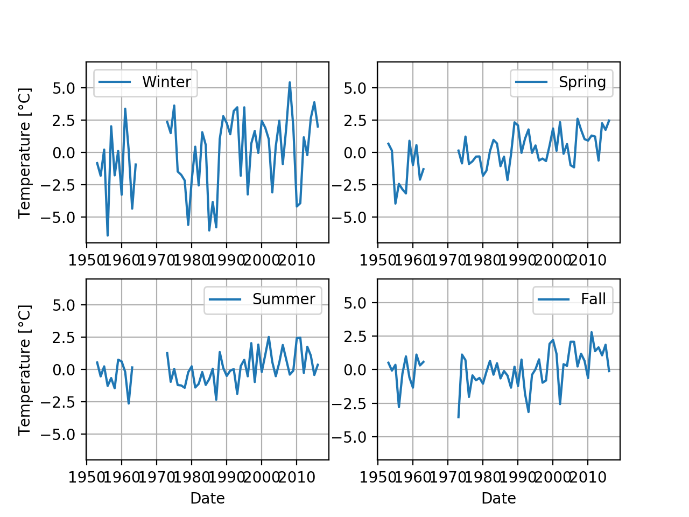

# Exercise 7: Plotting climate data in Python

This week we'll put together our data analysis and plotting skills using Pandas and Matplotlib to visualize the temperature data we have been exploring for the course thus far.
For each problem you will create or modify a Python script, then upload your files to GitHub.
The answers to the questions in this week's exercise should be given by modifying the document in places where asked or at the end of this document in the [section titled Answers](#answers).

- **Exercise 4 is due by 16:00 on 27.10.**
- Don't forget to check out [the hints for this week's exercise](https://geo-python.github.io/2017/lessons/L7/exercise-7-hints.html) if you're having trouble.
- Scores on this exercise are out of 20 points.

## Problem 0 - Creating the data file for this week

Your first task in this exercise is to write out a file with the contents of the Pandas DataFrame(s) you produced in [Exercise 6](https://github.com/Geo-Python-2017/Exercise-6), Problems 3 and 4.
As described in [Lesson 5](https://geo-python.github.io/2017/lessons/L5/pandas-basic-operations.html#writing-data), data can be saved to a file in Pandas using `dataFrame.to_csv('file.csv, sep=',')`.
Start by creating one data file for the Helsinki temperature data (`helsinki.csv`) and a second for the Sodankylä data (`sodankyla.csv`).

## Problem 1 - Doing time, plotting temperatures (5 points)

In this problem the goals are to:

1. Load the Helsinki temperature data file produced above (`helsinki.csv`) into Pandas
2. Convert the `DATE_m` column to the Pandas datetime format.
3. Set the `DATE_m` column as the DataFrame index
4. Make a line plot of temperatures in Celsius from 2010-2017.
    - The line should be a dashed black line with circles for the data points, and include a descriptive title and axis labels.

Save your Python script file as `temperature_plot.py` in GitHub and include a copy of the plot it produces in your answer to Problem 1 below.
More guidance on this problem can be found in [the hints for this week's exercise](https://geo-python.github.io/2017/lessons/L7/exercise-7-hints.html).

## Problem 2 - Seasonal temperature anomalies, visualized (5 points)

 
*The goal for this exercise is to make this plot.*

For Problem 2, the goal is to recreate the plot above, a 4-panel plot showing seasonal temperature anomalies from 1953-2016.
To do this, you should:

1. Start by creating a new Python script called `anomaly_subplots.py` and performing steps 1-3 from Problem 1 to prepare the data for plotting.
2. Create a yearly Pandas datetime index from 1953-2016 using the `pd.date_range()` function.
3. Create an empty Pandas DataFrame called `seasonalData` using the index you just created and column titles 'Winter', 'Spring', 'Summer', and 'Fall'.
4. Fill the data frame with mean temperatures for each season in each year.
    - Assume that Winter is December-February, Spring is March-May, Summer is June-August, and Fall is September-November.
5. Create a figure with 4 subplots in the arrangement shown above, labeling axes as needed, with gridlines on, and with a line legend for each panel.
    - You can find tips about these different plot features in the [Matplotlib documentation](https://matplotlib.org/contents.html) and [the hints for this week's exercise](https://geo-python.github.io/2017/lessons/L7/exercise-7-hints.html).

Save your Python script in GitHub and include a copy of the plot it produces in your answer to Problem 2 below.

# Answers

## Problem 1 - Answers to questions

### 1. 

### 2.

### 3. 

